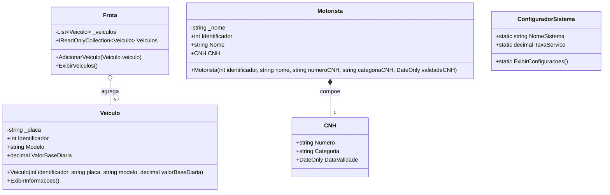

# Diagrama de Classes - UrbanDrive

```mermaid
classDiagram

    class Veiculo {
        -string _placa
        +int Identificador
        +string Modelo
        +decimal ValorBaseDiaria
        +Veiculo(int identificador, string placa, string modelo, decimal valorBaseDiaria)
        +ExibirInformacoes()
    }

    class Frota {
        -List~Veiculo~ _veiculos
        +IReadOnlyCollection~Veiculo~ Veiculos
        +AdicionarVeiculo(Veiculo veiculo)
        +ExibirVeiculos()
    }

    class Motorista {
        -string _nome
        +int Identificador
        +string Nome
        +CNH CNH
        +Motorista(int identificador, string nome, string numeroCNH, string categoriaCNH, DateOnly validadeCNH)
    }

    class CNH {
        +string Numero
        +string Categoria
        +DateOnly DataValidade
    }

    class ConfiguradorSistema {
        +static string NomeSistema
        +static decimal TaxaServico
        +static ExibirConfiguracoes()
    }

    Frota o-- "0..*" Veiculo : agrega
    Motorista *-- "1" CNH : compoe
```
